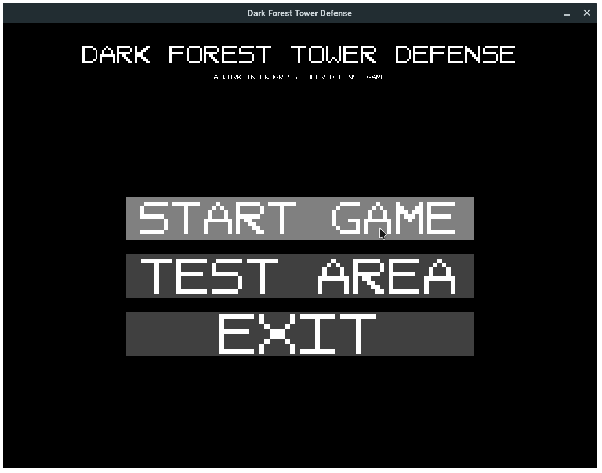

# Dark Forest Tower Defense

> A tower defense game that I made back in 2014 using my custom game library



*Dark Forest Tower Defense* has no official level progression or waves system, but at the time I did manage to complete basic tower and monster interaction, as well as an extremely simplified level file format. While admittedly this is far from a completed project, I thought it might be interesting to publically release yet another piece of my history.

If you're interested in seeing other ancient projects of mine, you should check out [Astra](https://github.com/Rayzr522/Astra) and [jPuzzle](https://github.com/Rayzr522/jPuzzle).

## Installation

The easiest way to install this is to simply grab the latest JAR file off of the [releases page](https://github.com/Rayzr522/Dark-Forest-Tower-Defense/releases). Once you have that, it's as simple as double-clicking it.

If you want to compile from the source code, just run the following commands:

```bash
$ git clone https://github.com/Rayzr522/Dark-Forest-Tower-Defense.git
$ cd Dark-Forest-Tower-Defense
$ mvn
# Output will be located at target/Dark-Forest-Tower-Defense.jar
```

## Join Me

[](https://discord.io/rayzrdevofficial)
